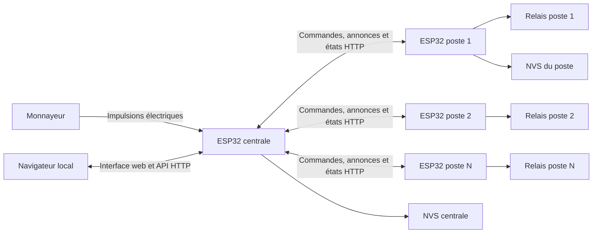

# PS TIME MANAGER sur ESP32

Ce dépôt contient les deux firmwares Arduino qui composent un système local de
gestion de postes de jeu à monnayeur :

- **`central-esp32`** : la centrale reçoit les impulsions du monnayeur, conserve
  le solde de coins et distribue du temps de jeu depuis une interface web ;
- **`poste-esp32`** : le contrôleur installé sur chaque poste reçoit la durée de
  jeu, commande un relais et renvoie son état à la centrale.

Chaque dossier est un sketch Arduino autonome à compiler et à téléverser sur un
ESP32 différent. Une centrale peut piloter plusieurs postes qui exécutent tous
le même firmware, avec une identité propre enregistrée en mémoire.

## Documentation

- [Manuel complet de la centrale](central-esp32/README.md)
- [Manuel complet d'un poste](poste-esp32/README.md)

Ces deux manuels détaillent la mise en service, toutes les routes HTTP, les
exemples `curl`, la persistance, le dépannage et les limites propres à chaque
firmware. Le présent README décrit surtout l'architecture et le fonctionnement
du système complet.

## Architecture générale



La centrale est le point de décision. Un poste ne compte pas les pièces et ne
gère pas le solde : il exécute uniquement les commandes de session reçues et
maintient son relais actif pendant la durée demandée.

## Fonctionnement du système

### 1. Démarrage de la centrale

La centrale charge depuis sa mémoire NVS :

- la configuration des coins ;
- le solde disponible ;
- les comptes et le token de l'API ;
- la liste des postes connus ;
- les identifiants Wi-Fi.

Elle crée ou migre ensuite le compte administrateur, se connecte au Wi-Fi et
publie `http://gameroom.local` avec mDNS. Si aucun réseau valide n'est enregistré,
elle ouvre un point d'accès `GAMEROOM-CENTRAL-<chipId>` et son portail captif.

### 2. Démarrage d'un poste

Le poste calcule son `chipId` matériel, charge son identité et ses identifiants
Wi-Fi depuis la NVS, puis force le relais à l'arrêt. En cas d'échec Wi-Fi, il
ouvre un point d'accès `GAMEROOM-POSTE-<chipId>`.

Une fois connecté, il publie son propre service mDNS, résout `gameroom.local` et
annonce son état à la centrale toutes les cinq secondes.

### 3. Découverte et configuration

Un poste neuf n'a pas encore de nom. Son annonce le place dans la liste des
postes découverts de la centrale. Depuis l'interface d'administration, on lui
attribue uniquement un nom visible, par exemple `Poste 1`. La centrale utilise
automatiquement le `chipId` matériel comme identifiant technique unique et ne le
demande pas à l'utilisateur.

La centrale transmet cette identité à `POST /configure`. Les deux appareils la
sauvegardent ensuite dans leur NVS. Une annonce absente pendant 30 secondes fait
disparaître un poste non encore configuré de la liste d'attente.

### 4. Réception d'une pièce

Le monnayeur est lu sur le GPIO 27 de la centrale, en `INPUT_PULLUP`, sur front
descendant. L'interruption applique un anti-rebond de 80 ms. Le nombre
d'impulsions requis par coin est configurable ; chaque groupe complet augmente
le solde central persistant.

Valeurs par défaut :

| Paramètre | Valeur |
|---|---:|
| Impulsions par coin | 1 |
| Durée par coin | 1 800 s, soit 30 min |
| Solde initial | 0 coin |

### 5. Affectation du temps à un poste

Lorsqu'un utilisateur affecte des coins, la centrale calcule :

```text
durée envoyée = coins affectés × durée d'un coin
```

Elle envoie ensuite au poste :

- `START_SESSION` si le poste est inactif ;
- `ADD_TIME` s'il est déjà actif ;
- `STOP_SESSION` lors d'un arrêt manuel.

Les coins ne sont débités qu'après une réponse HTTP réussie du poste. Sur le
poste, `START_SESSION` active le relais et fixe la date de fin ; `ADD_TIME`
prolonge cette date. La boucle principale coupe automatiquement le relais quand
le temps arrive à zéro.

### 6. Supervision

En plus des annonces, la centrale interroge un poste configuré toutes les cinq
secondes, à tour de rôle, avec `GET /status`. Elle affiche son état, son IP, le
relais et le temps restant. Un poste sans réponse valide depuis plus de dix
secondes passe à l'état `offline`.

### 7. Reprise après une coupure électrique

Pendant une session, chaque poste enregistre un instantané du temps restant dans
sa NVS au démarrage de la session, après chaque ajout de temps, puis toutes les
60 secondes. Si le poste redémarre alors qu'un instantané actif existe :

1. le relais reste coupé pour éviter une reprise non contrôlée ;
2. le poste passe à l'état `recovery_pending` ;
3. il annonce séparément le temps récupérable à la centrale ;
4. la centrale affiche **Reprise en attente** sur la carte du poste concerné ;
5. l'opérateur peut **Reprendre** le temps sauvegardé ou l'**Annuler**.

Chaque poste possède son propre état de reprise. Plusieurs sessions interrompues
peuvent donc être traitées indépendamment depuis la centrale. Une relance envoie
`START_SESSION` avec le temps sauvegardé. Une annulation envoie `STOP_SESSION`
et efface définitivement l'instantané du poste.

L'ESP32 ne disposant pas ici d'une horloge secourue, le temps passé hors tension
n'est pas déduit. Avec l'intervalle par défaut, le temps proposé peut également
être supérieur au temps réel d'au plus environ 60 secondes.

## Communication entre les deux firmwares

Les ESP32 doivent être sur un réseau local qui autorise les communications entre
clients et la résolution mDNS.

| Sens | Route | Rôle |
|---|---|---|
| Poste vers centrale | `POST /poste/announce` | Annonce l'identité, l'IP, l'état, le relais et le temps restant. |
| Centrale vers poste | `GET /status` | Lit l'état courant du poste. |
| Centrale vers poste | `POST /configure` | Attribue ou modifie l'identité logique. |
| Centrale vers poste | `POST /identity/clear` | Efface l'identité et remet le poste en découverte. |
| Centrale vers poste | `POST /command` | Envoie `START_SESSION`, `ADD_TIME`, `STOP_SESSION` ou `PING`. |

La centrale expose également `POST /recovery/resume` et
`POST /recovery/cancel` aux comptes connectés et aux clients possédant son token
API. Ces routes règlent individuellement la reprise de chaque poste.

Les annonces et commandes utilisent un secret Bearer partagé. Ces deux
constantes doivent contenir exactement la même valeur :

```cpp
// central-esp32/AppConfig.h
POSTE_COMMAND_TOKEN

// poste-esp32/PosteConfig.h
COMMAND_TOKEN
```

Ce secret inter-ESP32 est distinct du token API généré par la centrale pour les
clients externes.

## Interface et droits

La centrale fournit une interface web responsive sur son IP et sur
`http://gameroom.local`.

| Fonction | Administrateur | Utilisateur simple |
|---|:---:|:---:|
| Voir les postes et le solde | Oui | Oui |
| Affecter des coins et arrêter une session | Oui | Oui |
| Relancer ou annuler une session interrompue | Oui | Oui |
| Simuler une pièce | Oui | Non |
| Configurer ou supprimer les postes | Oui | Non |
| Modifier la configuration et le Wi-Fi | Oui | Non |
| Gérer les comptes, les logs et le token API | Oui | Non |

Au premier démarrage, le compte est `admin` avec le mot de passe `admin1234`.
Il doit être modifié immédiatement. Les mots de passe sont salés et hachés en
SHA-256 avant leur stockage ; les sessions web restent uniquement en RAM.

## Matériel et câblage

Matériel minimal :

- un ESP32 pour la centrale ;
- un ESP32 par poste de jeu ;
- un monnayeur à impulsions avec une adaptation électrique vers 3,3 V ;
- un module relais adapté à chaque charge ;
- un réseau Wi-Fi local ;
- des alimentations adaptées et un câblage sécurisé.

La centrale utilise par défaut le GPIO 27 pour le monnayeur. Le firmware du
poste utilise `LED_BUILTIN`, ou le GPIO 2 comme repli, pour les tests ; avant de
connecter une machine, il faut définir le vrai GPIO dans `PosteConfig.h` et adapter
`RELAY_ACTIVE_HIGH` au module relais.

> Un GPIO ESP32 n'accepte pas directement les tensions d'un monnayeur et ne doit
> jamais alimenter une charge de puissance. Utiliser une interface 3,3 V,
> l'isolation et les protections adaptées. Le câblage secteur doit être confié à
> une personne qualifiée.

## Compilation et téléversement

### Prérequis

- Arduino IDE ou `arduino-cli` ;
- le cœur **esp32 by Espressif Systems** ;
- la bibliothèque **ArduinoJson** ;
- une carte compatible, par exemple **ESP32 Dev Module**.

Les bibliothèques `WiFi`, `WebServer`, `DNSServer`, `Preferences`, `ESPmDNS`,
`HTTPClient` et mbedTLS sont fournies par le cœur ESP32.

### Centrale

1. Ouvrir `central-esp32/central-esp32.ino` dans Arduino IDE.
2. Remplacer les secrets et vérifier `COIN_PIN` dans `AppConfig.h`.
3. Compiler puis téléverser sur l'ESP32 central.
4. Ouvrir le moniteur série à 115200 bauds.

Avec `arduino-cli` :

```bash
arduino-cli compile --fqbn esp32:esp32:esp32 central-esp32
arduino-cli upload --fqbn esp32:esp32:esp32 --port PORT_CENTRALE central-esp32
```

### Poste

1. Ouvrir `poste-esp32/poste-esp32.ino` dans Arduino IDE.
2. Reporter le secret inter-ESP32, choisir `RELAY_PIN` et vérifier la polarité.
3. Compiler puis téléverser sur chaque ESP32 de poste.
4. Ouvrir le moniteur série à 115200 bauds.

Avec `arduino-cli` :

```bash
arduino-cli compile --fqbn esp32:esp32:esp32 poste-esp32
arduino-cli upload --fqbn esp32:esp32:esp32 --port PORT_POSTE poste-esp32
```

## Mise en service rapide

1. Téléverser et démarrer la centrale.
2. Se connecter à `GAMEROOM-CENTRAL-<chipId>` avec le mot de passe `12345678`.
3. Ouvrir `http://192.168.4.1` et sélectionner le réseau local.
4. Ouvrir `http://gameroom.local`, se connecter avec `admin` / `admin1234`, puis
   changer immédiatement le mot de passe.
5. Téléverser et démarrer un poste configuré avec le même secret partagé.
6. Si nécessaire, rejoindre son point d'accès `GAMEROOM-POSTE-<chipId>`, ouvrir
   `http://192.168.4.1` et choisir le même réseau local.
7. Dans **Gestion des postes**, attendre le `chipId`, puis attribuer un `id` et
   un nom au poste.
8. Simuler un coin ou insérer une pièce, affecter le crédit au poste et vérifier
   que le relais s'active et que le temps diminue.

## Persistance et redémarrage

| Appareil | Namespace NVS | Données conservées |
|---|---|---|
| Centrale | `wifi` | SSID, mot de passe et configuration DHCP ou IPv4 statique. |
| Centrale | `appcfg` | Durée par coin, impulsions par coin et solde. |
| Centrale | `auth` | Comptes, hashes salés et token API. |
| Centrale | `posts` | Identité et dernière IP des postes configurés. |
| Poste | `wifi` | SSID, mot de passe et configuration DHCP ou IPv4 statique. |
| Poste | `identity` | Identifiant logique et nom du poste. |
| Poste | `session` | Dernier temps restant sauvegardé ; une valeur positive indique une session interrompue. |

Ne sont pas persistants : les logs et sessions web de la centrale, les postes
en attente et les statuts instantanés. Après le redémarrage d'un poste interrompu,
son relais reste coupé, mais le dernier temps sauvegardé est proposé à la
centrale pour une relance ou une annulation explicite.

## Rôle de chaque fichier

### Firmware de la centrale

| Fichier | Rôle |
|---|---|
| `central-esp32/central-esp32.ino` | Point d'entrée Arduino : crée l'état global et le serveur, initialise les services et exécute leur boucle. |
| `central-esp32/AppConfig.h` | Regroupe les valeurs par défaut, secrets, GPIO, port et délais. |
| `central-esp32/AppState.h` | Définit l'état partagé en RAM : crédits, impulsions, comptes, sessions, logs et postes. |
| `central-esp32/Post.h` | Définit la structure d'un poste configuré, son dernier état connu et une éventuelle reprise en attente. |
| `central-esp32/AuthService.h` | Déclare l'API interne d'authentification et de gestion des utilisateurs. |
| `central-esp32/AuthService.cpp` | Gère les comptes, rôles, hashes de mots de passe, cookies de session et tokens Bearer. |
| `central-esp32/CoinService.h` | Déclare le service de lecture du monnayeur. |
| `central-esp32/CoinService.cpp` | Traite l'interruption GPIO, l'anti-rebond et la conversion des impulsions en coins persistants. |
| `central-esp32/LogService.h` | Déclare le service de journalisation. |
| `central-esp32/LogService.cpp` | Écrit sur le port série et conserve les 100 derniers événements en RAM. |
| `central-esp32/PostService.h` | Déclare la logique métier de gestion des postes. |
| `central-esp32/PostService.cpp` | Gère découverte, configuration, crédits, arrêt, reprise après coupure, suppression et état hors ligne. |
| `central-esp32/PosteClient.h` | Déclare le client HTTP utilisé pour joindre un poste. |
| `central-esp32/PosteClient.cpp` | Envoie les commandes et configurations au poste, et décode la réponse de `/status`. |
| `central-esp32/StorageService.h` | Déclare la persistance et l'import/export de configuration. |
| `central-esp32/StorageService.cpp` | Lit et écrit les namespaces NVS avec `Preferences` et sérialise les données en JSON. |
| `central-esp32/WifiService.h` | Déclare la connexion normale au réseau et le démarrage mDNS. |
| `central-esp32/WifiService.cpp` | Utilise le Wi-Fi enregistré et publie le service HTTP `gameroom.local`. |
| `central-esp32/WifiProvisioning.h` | Déclare le mode de configuration Wi-Fi. |
| `central-esp32/WifiProvisioning.cpp` | Implémente le point d'accès, le DNS captif, le scan, le formulaire et la sauvegarde Wi-Fi. |
| `central-esp32/WebRoutes.h` | Déclare l'enregistrement des routes du serveur web. |
| `central-esp32/WebRoutes.cpp` | Implémente les pages, l'API JSON, les autorisations et la réception des annonces. |
| `central-esp32/WebPage.h` | Déclare les générateurs des pages web embarquées. |
| `central-esp32/WebPage.cpp` | Contient le HTML, le CSS et le JavaScript de la connexion et de l'interface d'administration. |
| `central-esp32/README.md` | Manuel détaillé du firmware central, de son interface et de son API. |

### Firmware d'un poste

| Fichier | Rôle |
|---|---|
| `poste-esp32/poste-esp32.ino` | Point d'entrée Arduino : initialise identité, relais, serveur, Wi-Fi et annonces. |
| `poste-esp32/PosteConfig.h` | Regroupe Wi-Fi de secours, portail, mDNS, secret partagé, GPIO relais, polarité et intervalle de sauvegarde. |
| `poste-esp32/PosteState.h` | Définit l'état partagé en RAM : identité, connexion, session, reprise en attente et relais. |
| `poste-esp32/PosteIdentityService.h` | Déclare la gestion de l'identité persistante. |
| `poste-esp32/PosteIdentityService.cpp` | Calcule le `chipId` eFuse et charge, sauvegarde ou efface `id` et `name` dans la NVS. |
| `poste-esp32/RelayService.h` | Déclare le pilotage du relais et des sessions. |
| `poste-esp32/RelayService.cpp` | Pilote le relais, gère les sessions et sauvegarde/restaure le temps récupérable après une coupure. |
| `poste-esp32/PosteAnnounceService.h` | Déclare l'annonce périodique vers la centrale. |
| `poste-esp32/PosteAnnounceService.cpp` | Résout la centrale par mDNS et lui envoie l'identité et l'état du poste en JSON. |
| `poste-esp32/PosteWebServer.h` | Déclare les routes HTTP propres au poste. |
| `poste-esp32/PosteWebServer.cpp` | Implémente `/status`, `/configure`, `/identity/clear`, `/command` et la validation Bearer. |
| `poste-esp32/WiFiConfigService.h` | Déclare l'initialisation et le suivi du Wi-Fi. |
| `poste-esp32/WiFiConfigService.cpp` | Gère les identifiants Wi-Fi, la connexion, le point d'accès, le portail captif et son DNS. |
| `poste-esp32/README.md` | Manuel détaillé du firmware de poste, de son câblage et de son API. |

### Fichiers sans rôle fonctionnel

| Élément | Rôle |
|---|---|
| `README.md` | Documentation générale du système complet. |
| `.DS_Store`, `central-esp32/.DS_Store`, `poste-esp32/.DS_Store` | Métadonnées Finder de macOS ; elles ne participent ni à la compilation ni à l'exécution. |
| `central-esp32/tmp/` | Répertoire local vide ; il ne fait pas partie du firmware suivi par Git. |

Les fichiers `.h` définissent les structures et interfaces publiques. Les
fichiers `.cpp` portent leur implémentation, tandis que chaque `.ino` orchestre
le démarrage et la boucle principale de son ESP32.

## Sécurité avant déploiement

Modifier impérativement les valeurs de développement :

- le mot de passe administrateur `admin1234` ;
- le mot de passe du point d'accès central `12345678` ;
- le secret partagé `POSTE_COMMAND_TOKEN` / `COMMAND_TOKEN` ;
- le token API de la centrale, depuis l'interface ;
- éventuellement le mot de passe du portail Wi-Fi des postes, ouvert par défaut.

Le système utilise HTTP sans TLS. Il doit rester sur un réseau local privé, sans
redirection de port depuis Internet. Le token partagé et les identifiants Wi-Fi
sont présents dans le firmware ou la NVS sans chiffrement applicatif.

## Limites importantes

- une reprise après coupure nécessite une décision manuelle et n'est précise
  qu'à l'intervalle du dernier instantané, 60 secondes par défaut ;
- le temps écoulé pendant la coupure n'est pas déduit sans horloge RTC secourue ;
- raccourcir fortement l'intervalle de sauvegarde augmente l'usure de la flash ;
- la résolution de `gameroom.local` dépend du support mDNS du réseau ;
- les postes sont interrogés séquentiellement, donc un tour complet prend
  environ cinq secondes multipliées par leur nombre ;
- les logs de la centrale sont limités à 100 entrées et perdus au redémarrage ;
- le serveur Arduino convient à un petit réseau local, pas à une exposition
  publique ou à une forte charge ;
- le changement du secret inter-ESP32 exige de recompiler la centrale et tous
  les postes avec exactement la même valeur.
