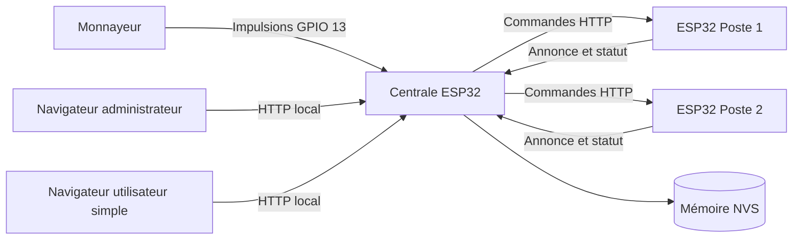
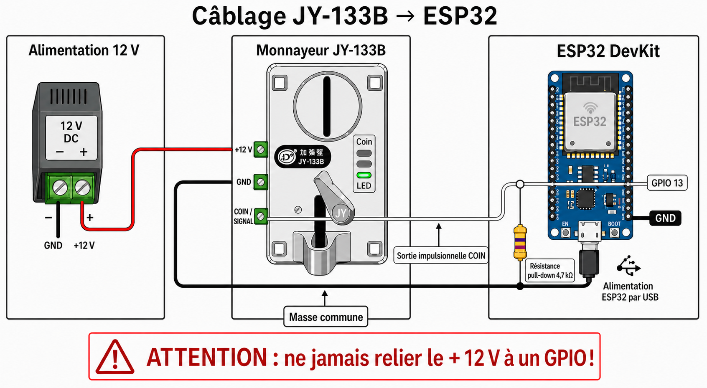

# Centrale ESP32 - Monnayeur Game Room

Firmware de la centrale d'un système de gestion de postes de jeu à monnayeur.
La centrale ESP32 reçoit les impulsions du monnayeur, transforme ces impulsions
en crédits, découvre les ESP32 installés sur les postes et distribue du temps de
jeu depuis une interface web locale.

## Sommaire

- [Fonctions principales](#fonctions-principales)
- [Architecture](#architecture)
- [Démarrage du firmware](#démarrage-du-firmware)
- [Gestion des coins](#gestion-des-coins)
- [Gestion des postes](#gestion-des-postes)
- [Gestion des utilisateurs](#gestion-des-utilisateurs)
- [Interface web](#interface-web)
- [Installation et compilation](#installation-et-compilation)
- [Manuel d'utilisation](#manuel-dutilisation)
- [API HTTP](#api-http)
- [Persistance des données](#persistance-des-données)
- [Rôle de chaque fichier](#rôle-de-chaque-fichier)
- [Sécurité](#sécurité)
- [Dépannage](#dépannage)
- [Limites connues](#limites-connues)

## Fonctions principales

- configuration Wi-Fi par point d'accès et portail captif ;
- accès local par adresse IP ou `http://gameroom.local` ;
- lecture du monnayeur sur le GPIO 13 ;
- conversion configurable des impulsions en coins ;
- crédit disponible sauvegardé en mémoire NVS ;
- découverte automatique des ESP32 des postes ;
- configuration, renommage et suppression des postes ;
- démarrage, prolongation et arrêt des sessions ;
- détection et traitement indépendant des sessions interrompues après coupure ;
- surveillance de l'état, du relais et du temps restant ;
- interface web responsive embarquée dans le firmware ;
- comptes multiples avec rôles `admin` et `user` ;
- journal des 100 derniers événements ;
- import et export de la configuration générale ;
- API HTTP protégée par session ou token Bearer.

## Architecture



La centrale est le point de décision du système. Les postes doivent exécuter un
firmware compatible fournissant les endpoints `/status`, `/command`,
`/configure` et `/identity/clear`. Ce firmware de poste n'est pas inclus dans ce
dossier.

### Composants internes

| Composant | Responsabilité |
|---|---|
| Point d'entrée Arduino | Initialise les services et exécute la boucle principale. |
| Wi-Fi | Connexion au réseau existant ou ouverture du portail de configuration. |
| Monnayeur | Compte les impulsions et alimente le crédit central. |
| Gestion des postes | Découverte, identité, sessions et surveillance. |
| Client des postes | Échanges HTTP entre la centrale et chaque poste. |
| Authentification | Comptes, mots de passe, sessions et permissions. |
| Stockage | Persistance dans la mémoire NVS de l'ESP32. |
| Web | Pages HTML/CSS/JavaScript et routes de l'API. |
| Logs | Journal en RAM et sortie série. |

## Démarrage du firmware

La fonction `setup()` exécute les opérations suivantes :

1. ouverture du port série à 115200 bauds ;
2. chargement de la configuration NVS ;
3. création ou migration du compte administrateur ;
4. tentative de connexion au Wi-Fi enregistré pendant 15 secondes ;
5. démarrage du portail Wi-Fi si la connexion échoue ;
6. sinon, démarrage de mDNS, du monnayeur, des postes et du serveur web.

En mode normal, `loop()` traite continuellement :

- les requêtes HTTP ;
- les impulsions reçues du monnayeur ;
- l'expiration des postes en attente ;
- l'interrogation périodique des postes configurés.

### Mode de configuration Wi-Fi

Si aucun Wi-Fi valide n'est enregistré, la centrale crée ce point d'accès :

| Paramètre | Valeur par défaut |
|---|---|
| SSID | `GAMEROOM-CENTRAL-<chipId>` |
| Mot de passe | `12345678` |
| Adresse du portail | `http://192.168.4.1` |

Le portail scanne les réseaux disponibles et propose deux modes d'adressage :

- **Automatique (DHCP)**, utilisé par défaut et compatible avec les anciennes
  configurations enregistrées ;
- **Manuel (IP fixe)**, avec adresse IPv4, passerelle, masque de sous-réseau et
  DNS principal/secondaire facultatifs.

Les identifiants et les paramètres réseau sont validés puis enregistrés
uniquement après une connexion réussie. La centrale redémarre ensuite avec la
même configuration. Il n'existe pas de proxy HTTP système sur l'ESP32 : les
communications avec les postes et mDNS restent directes sur le réseau local.
Le suffixe `chipId`, calculé depuis l'eFuse, distingue aussi plusieurs centrales
qui seraient simultanément en mode configuration.

## Gestion des coins



Le fil de signal du monnayeur est relié au GPIO 13 configuré en `INPUT`.
La masse du monnayeur et celle de l'ESP32 doivent être communes. Le firmware ne
compte une impulsion qu'après avoir observé un niveau bas complet entre 10 et
250 ms, ou un niveau haut de même durée si le monnayeur est réglé en contact
normalement fermé (`NC`). La polarité `NO`/`NC` est détectée automatiquement.
Un délai anti-rebond de 80 ms élimine ensuite les impulsions parasites rapprochées.

Pour un JY-133B alimenté en 12 V, relier la sortie `COIN` au GPIO 13 et partager
la masse avec l'ESP32. Une résistance pull-down externe de 4,7 kΩ doit relier
le GPIO 13 au GND. Elle maintient un niveau bas stable lorsque la sortie du
monnayeur est inactive. Vérifier au multimètre que le signal `COIN` ne dépasse
jamais 3,3 V : ne jamais relier directement un signal 12 V au GPIO. Conserver
le câble de signal court et éloigné des relais et des fils 12 V.

```text
nouveaux coins = nouvelles impulsions / impulsions par coin
durée attribuée = nombre de coins x durée par coin
```

Valeurs initiales :

| Paramètre | Valeur |
|---|---:|
| Impulsions par coin | 1 |
| Durée d'un coin | 1800 secondes (30 minutes) |
| Coins disponibles | 0 |

Le solde est sauvegardé après chaque détection ou attribution. Lors d'une
affectation, les coins ne sont retirés qu'après une réponse HTTP réussie du
poste.

> Attention : les GPIO de l'ESP32 fonctionnent en 3,3 V. Ne jamais injecter
> directement une tension supérieure. Selon le monnayeur, utiliser un
> optocoupleur, un transistor ou un circuit d'adaptation approprié et relier les
> masses seulement si le schéma électrique le permet.

## Gestion des postes

### Découverte

Chaque ESP32 de poste annonce périodiquement son identité à la centrale avec
`POST /poste/announce` et le token partagé des postes.

- Un poste sans identité apparaît dans **Postes découverts**.
- Un poste configuré est ajouté ou actualisé dans la liste permanente.
- Une découverte non configurée disparaît après 30 secondes sans annonce.

### Configuration d'un nouveau poste

L'administrateur choisit **Ajouter**, puis fournit uniquement un nom visible,
par exemple `Poste 1`. La centrale reprend automatiquement le `chipId` matériel
comme identifiant technique unique ; cet identifiant n'est ni affiché ni saisi.

La centrale envoie l'identité technique et le nom à `POST http://IP/configure`.
Le poste est ensuite sauvegardé dans la NVS de la centrale.

### Sessions de jeu

Lors de l'affectation de coins :

- la centrale envoie `START_SESSION` si le poste est inactif ;
- elle envoie `ADD_TIME` si le poste est déjà actif ;
- le bouton **Arrêter** envoie `STOP_SESSION`.

Si un poste redémarre pendant une session, son firmware compatible annonce
`recoveryPending=true` avec `recoveryRemaining`. La centrale affiche alors une
proposition de reprise propre à ce poste. L'opérateur peut reprendre le temps
sauvegardé ou l'annuler définitivement.

Le relais du poste reste coupé tant qu'aucune décision n'a été envoyée. Les
reprises de plusieurs postes sont affichées et traitées indépendamment.

### Surveillance

La centrale interroge un poste toutes les 5 secondes avec `GET /status`. Les
postes sont interrogés à tour de rôle. Après un échec et plus de 10 secondes sans
réponse valide, le poste passe à l'état `offline`.

Les informations affichées sont :

- identifiant et nom ;
- adresse IP ;
- état `idle`, `active`, `recovery_pending`, `offline`, `error` ou `unknown` ;
- état du relais ;
- temps restant.

Un poste actif, possédant encore du temps ou attendant une décision de reprise
ne peut pas être modifié ou supprimé.

## Gestion des utilisateurs

### Compte par défaut

| Champ | Valeur |
|---|---|
| Nom d'utilisateur | `admin` |
| Mot de passe | `12345678` |
| Rôle | Administrateur |

Au premier démarrage après mise à jour d'une ancienne version, l'ancien mot de
passe administrateur est migré vers le compte `admin`.

### Données d'un compte

Un utilisateur possède :

- un nom d'utilisateur unique, normalisé en minuscules ;
- un prénom ;
- un nom ;
- un mot de passe d'au moins 6 caractères pour les nouveaux comptes ;
- un rôle `admin` ou `user`.

Les mots de passe sont sauvegardés sous forme de hash SHA-256 avec un sel aléatoire.
Ils ne sont jamais renvoyés par l'API ni inclus dans l'export de configuration.

### Permissions

| Fonction | Administrateur | Utilisateur simple |
|---|:---:|:---:|
| Consulter les postes et leur état | Oui | Oui |
| Affecter des coins | Oui | Oui |
| Arrêter un poste | Oui | Oui |
| Relancer ou annuler une session interrompue | Oui | Oui |
| Simuler un coin | Oui | Non |
| Configurer, modifier ou supprimer un poste | Oui | Non |
| Modifier la configuration générale | Oui | Non |
| Consulter ou vider les logs | Oui | Non |
| Gérer les utilisateurs | Oui | Non |
| Modifier le Wi-Fi | Oui | Non |
| Gérer le token API | Oui | Non |

La centrale accepte jusqu'à 10 comptes. Elle empêche la suppression de son
propre compte, la modification de son propre rôle et la suppression ou la
rétrogradation du dernier administrateur.

## Interface web

### Pages accessibles à tous les comptes connectés

- `/` : tableau de bord, état des postes, coins disponibles et commandes autorisées ;
- `/login` : connexion ;
- déconnexion depuis la barre supérieure.

### Pages réservées aux administrateurs

- `/config` : durée d'un coin, impulsions par coin, solde, import et export ;
- `/logs` : journal des événements ;
- `/postes` : postes configurés et postes découverts ;
- `/users` : création et administration des comptes ;
- `/security` : mot de passe de l'administrateur et token API.

Les permissions sont contrôlées côté serveur. Masquer un bouton dans le
navigateur ne suffit donc pas à contourner les restrictions.

## Installation et compilation

### Matériel et logiciels

- carte ESP32 compatible avec le framework Arduino ;
- câble USB de données ;
- Arduino IDE ou `arduino-cli` ;
- package de cartes **esp32 by Espressif Systems** ;
- bibliothèque **ArduinoJson**.

Le projet a été vérifié avec le cœur ESP32 3.3.11 et la cible
`esp32:esp32:esp32`.

### Avec Arduino IDE

1. Ouvrir `central-esp32.ino`.
2. Installer ArduinoJson depuis le gestionnaire de bibliothèques.
3. Sélectionner une carte compatible, par exemple **ESP32 Dev Module**.
4. Sélectionner le port série de la carte.
5. Cliquer sur **Vérifier**, puis **Téléverser**.
6. Ouvrir le moniteur série à 115200 bauds.

### Avec arduino-cli

```bash
arduino-cli core install esp32:esp32
arduino-cli lib install ArduinoJson
arduino-cli compile --fqbn esp32:esp32:esp32 .
arduino-cli upload --fqbn esp32:esp32:esp32 --port PORT_SERIE .
```

Adapter `PORT_SERIE`, par exemple `/dev/cu.usbserial-0001` sous macOS ou
`COM3` sous Windows.

## Manuel d'utilisation

### 1. Première mise en service

1. Alimenter la centrale et ouvrir le moniteur série.
2. Se connecter au Wi-Fi `GAMEROOM-CENTRAL-<chipId>` affiché dans le moniteur série.
3. Utiliser le mot de passe `12345678`.
4. Ouvrir `http://192.168.4.1` si le portail ne s'affiche pas automatiquement.
5. Sélectionner le réseau local partagé par la centrale et les postes.
6. Saisir son mot de passe et valider.
7. Attendre le redémarrage automatique.
8. Reconnecter le téléphone ou le PC au réseau local.
9. Ouvrir l'adresse IP affichée ou `http://gameroom.local`.

### 2. Première connexion

1. Saisir le nom d'utilisateur `admin`.
2. Saisir le mot de passe `12345678`.
3. Aller immédiatement dans **Mot de passe / Token**.
4. Choisir un nouveau mot de passe d'au moins 6 caractères.
5. Se reconnecter avec le nouveau mot de passe.

### 3. Ajouter un utilisateur simple

1. Ouvrir **Utilisateurs**.
2. Saisir un nom d'utilisateur unique, le prénom et le nom.
3. Définir un mot de passe d'au moins 6 caractères.
4. Sélectionner **Utilisateur simple**.
5. Cliquer sur **Ajouter**.

### 4. Ajouter un autre administrateur

Suivre la même procédure en sélectionnant **Administrateur**. Il est recommandé
de disposer d'au moins deux comptes administrateurs avant toute opération de
maintenance importante.

### 5. Ajouter un poste

1. Mettre le poste ESP32 compatible sous tension sur le même réseau.
2. Ouvrir **Gestion des postes**.
3. Attendre son apparition dans **Postes découverts**.
4. Cliquer sur **Ajouter**.
5. Saisir un identifiant et un nom.
6. Vérifier que le poste apparaît dans la liste configurée.

### 6. Affecter des coins

1. Vérifier le crédit disponible en haut du tableau de bord.
2. Repérer le poste voulu.
3. Cliquer sur **+1 coin** ou **+2 coins**.
4. Vérifier le passage à l'état `active`, le relais `ON` et le temps restant.

Si le poste est déjà actif, le temps est ajouté à la session existante.

### 7. Arrêter un poste

Cliquer sur **Arrêter** sur la carte du poste. Le poste reçoit `STOP_SESSION` et
son état local est immédiatement remis à `idle`, relais `OFF`, temps restant 0.

### 8. Traiter une session interrompue

Après le redémarrage d'un poste qui était actif :

1. repérer la carte marquée **Reprise en attente** ;
2. vérifier le temps sauvegardé avant la coupure ;
3. saisir `0` pour reprendre ce temps tel quel, ou saisir les minutes offertes à
   ajouter ;
4. cliquer sur **Relancer le poste** et confirmer ;
5. ou cliquer sur **Annuler le temps** pour effacer l'instantané sans relancer.

### 9. Modifier la valeur des coins

Dans **Configuration** :

- **Durée par coin** : nombre de secondes attribuées par coin ;
- **Impulsions par coin** : impulsions électriques nécessaires pour un coin ;
- **Crédit disponible** : correction administrative du solde.

Cliquer sur **Enregistrer** après modification.

### 10. Sauvegarder la configuration

Dans **Configuration**, cliquer sur **Exporter JSON** puis copier le contenu.
L'export contient les paramètres des coins, le solde et le token API. Il ne
contient pas les comptes, les mots de passe, les postes ni les identifiants Wi-Fi.

### 11. Réinitialiser le Wi-Fi

Cliquer sur **Reset Wi-Fi** et confirmer. Les identifiants Wi-Fi sont supprimés,
l'ESP32 redémarre et recrée le point d'accès de configuration.

## API HTTP

Les appels effectués par un navigateur connecté utilisent le cookie
`ESPSESSION`. Un client externe peut utiliser :

```http
Authorization: Bearer VOTRE_TOKEN_API
```

Le token API possède les permissions administrateur. Le token partagé des postes
est distinct et sert uniquement aux annonces et commandes entre ESP32.

### Routes générales

| Méthode | Route | Accès | Description |
|---|---|---|---|
| POST | `/login` | Public | Ouvre une session avec `username` et `password`. |
| POST | `/logout` | Session | Ferme la session courante. |
| GET | `/posts` | Connecté/API | État des postes et crédit disponible. |
| POST | `/assign` | Connecté/API | Affecte des coins à un poste. |
| POST | `/stop` | Connecté/API | Arrête une session. |
| POST | `/recovery/resume` | Connecté/API | Relance le temps sauvegardé. |
| POST | `/recovery/cancel` | Connecté/API | Annule le temps sauvegardé d'un poste. |

### Routes administrateur

| Méthode | Route | Description |
|---|---|---|
| POST | `/coins/simulate` | Ajoute un coin de test. |
| POST | `/config` | Modifie la configuration générale. |
| GET | `/config/export` | Exporte la configuration JSON. |
| POST | `/config/import` | Importe une configuration JSON. |
| POST | `/post/update` | Renomme un poste inactif. |
| POST | `/post/delete` | Supprime et déconfigure un poste inactif. |
| POST | `/post/ping` | Teste manuellement un poste. |
| POST | `/poste/configure` | Configure un poste découvert. |
| GET | `/logs/data` | Retourne les logs. |
| POST | `/logs/clear` | Vide les logs. |
| POST | `/wifi/reset` | Supprime les identifiants Wi-Fi et redémarre. |
| POST | `/auth/password` | Change le mot de passe du compte admin courant. |
| POST | `/auth/token/regenerate` | Régénère le token API. |
| GET | `/users/data` | Liste les comptes sans les mots de passe. |
| POST | `/users/create` | Crée un compte. |
| POST | `/users/update` | Modifie un compte ou réinitialise son mot de passe. |
| POST | `/users/delete` | Supprime un compte. |

### Route réservée aux postes ESP32

| Méthode | Route | Description |
|---|---|---|
| POST | `/poste/announce` | Reçoit l'annonce d'un poste avec le token partagé. |

### Exemples

Affecter deux coins :

```bash
curl -X POST http://gameroom.local/assign \
  -H 'Authorization: Bearer VOTRE_TOKEN_API' \
  -H 'Content-Type: application/json' \
  -d '{"post_id":"post1","coins":2}'
```

Créer un utilisateur simple :

```bash
curl -X POST http://gameroom.local/users/create \
  -H 'Authorization: Bearer VOTRE_TOKEN_API' \
  -H 'Content-Type: application/json' \
  -d '{"username":"sami","firstName":"Sami","lastName":"Ben Ali","password":"motdepasse","role":"user"}'
```

## Persistance des données

La classe `Preferences` enregistre les données dans plusieurs espaces NVS :

| Namespace | Données |
|---|---|
| `wifi` | SSID, mot de passe et configuration DHCP ou IPv4 statique. |
| `appcfg` | Durée d'un coin, impulsions par coin et solde. |
| `auth` | Token API et comptes avec hash des mots de passe. |
| `posts` | Identité et adresse IP des postes configurés. |

Les statuts, sessions web, postes en attente et logs restent en RAM et sont
réinitialisés au redémarrage. Les décisions de reprise ne dépendent cependant
pas de la NVS centrale : chaque poste conserve son propre instantané et le
réannonce après le redémarrage de la centrale.

## Rôle de chaque fichier

| Fichier | Rôle |
|---|---|
| `central-esp32.ino` | Point d'entrée : initialisation et boucle principale. |
| `AppConfig.h` | Constantes globales, GPIO, délais, valeurs et identifiants par défaut. |
| `AppState.h` | État partagé, comptes, sessions, crédits, logs et postes en mémoire. |
| `Post.h` | Structure représentant un poste configuré, y compris son éventuelle reprise en attente. |
| `AuthService.h` | Interface du service d'authentification et de gestion des comptes. |
| `AuthService.cpp` | Hash des mots de passe, connexion, sessions, rôles et CRUD utilisateurs. |
| `CoinService.h` | Interface du gestionnaire de monnayeur. |
| `CoinService.cpp` | Interruption GPIO, anti-rebond et conversion en coins. |
| `LogService.h` | Interface du journal d'événements. |
| `LogService.cpp` | Journal RAM limité à 100 événements et sortie série. |
| `PostService.h` | Interface de la logique métier des postes. |
| `PostService.cpp` | Découverte, configuration, sessions, reprise après coupure, suppression et surveillance. |
| `PosteClient.h` | Interface du client HTTP destiné aux postes. |
| `PosteClient.cpp` | Envoi des commandes et lecture du statut des postes. |
| `StorageService.h` | Interface de persistance et d'import/export. |
| `StorageService.cpp` | Lecture et écriture des namespaces NVS. |
| `WifiService.h` | Interface de connexion Wi-Fi et mDNS. |
| `WifiService.cpp` | Connexion au Wi-Fi sauvegardé et publication de `gameroom.local`. |
| `WifiProvisioning.h` | Interface du mode de configuration Wi-Fi. |
| `WifiProvisioning.cpp` | Point d'accès, DNS captif, scan, formulaire et sauvegarde Wi-Fi. |
| `WebRoutes.h` | Déclaration de l'enregistrement des routes web. |
| `WebRoutes.cpp` | API HTTP, contrôles d'accès et réponses JSON. |
| `WebPage.h` | Déclaration des pages HTML embarquées. |
| `WebPage.cpp` | HTML, CSS et JavaScript de la connexion et du tableau de bord. |
| `.DS_Store` | Métadonnées macOS sans rôle dans le firmware. |

## Sécurité

Avant une utilisation réelle :

1. changer immédiatement le mot de passe `12345678` ;
2. modifier `AP_PASSWORD` dans `AppConfig.h` ;
3. remplacer `POSTE_COMMAND_TOKEN` sur la centrale et tous les postes ;
4. régénérer le token API depuis l'interface ;
5. utiliser un réseau local isolé et protégé ;
6. ne pas exposer directement le port 80 à Internet.

L'interface utilise HTTP sans TLS. Les identifiants Wi-Fi sont stockés dans la
NVS sans chiffrement applicatif. Le hash salé protège les mots de passe des
comptes, mais un accès physique à la carte reste un risque à traiter au niveau du
déploiement.

## Dépannage

### Le portail Wi-Fi ne s'ouvre pas

- vérifier la connexion au SSID `GAMEROOM-CENTRAL-<chipId>` ;
- ouvrir manuellement `http://192.168.4.1` ;
- désactiver temporairement les données mobiles ou le VPN ;
- consulter le moniteur série à 115200 bauds.

### `gameroom.local` ne répond pas

- utiliser l'adresse IP affichée sur le port série ;
- vérifier que le client et l'ESP32 sont sur le même réseau ;
- certains réseaux ou appareils ne prennent pas correctement en charge mDNS.

### Un poste reste hors ligne

- vérifier son alimentation et son adresse IP ;
- confirmer que les deux ESP32 utilisent le même réseau ;
- vérifier que `POSTE_COMMAND_TOKEN` est identique ;
- tester **Ping** dans la gestion des postes ;
- confirmer que le poste expose bien `GET /status`.

### Les coins ne sont pas détectés

- contrôler le câblage du GPIO 13 et de la masse ;
- vérifier le niveau électrique et le circuit d'adaptation ;
- ajuster **Impulsions par coin** ;
- utiliser **+1 coin** de simulation pour distinguer un problème matériel d'un problème logiciel.

### Connexion refusée après mise à jour

- utiliser le nom d'utilisateur `admin` ;
- utiliser l'ancien mot de passe administrateur, automatiquement migré ;
- sur une installation neuve, utiliser `12345678`.

## Limites connues

- le firmware occupe environ 92 % de la partition programme standard ;
- les communications HTTP ne sont pas chiffrées ;
- les logs sont perdus au redémarrage ;
- le temps récupérable dépend du dernier instantané écrit par le poste et peut
  être supérieur au temps réel d'environ 60 secondes avec la configuration par défaut ;
- l'export ne contient pas une sauvegarde complète des comptes, postes et du Wi-Fi ;
- les postes sont interrogés un par un : avec `N` postes, un cycle complet prend environ `N x 5` secondes ;
- la liste des postes est réécrite en NVS lors de certaines annonces, ce qui peut augmenter l'usure de la flash si les annonces sont très fréquentes ;
- le firmware compatible des postes doit être fourni séparément.

## Valeurs configurables dans le code

Les constantes principales se trouvent dans `AppConfig.h` :

```cpp
AP_SSID_PREFIX
AP_PASSWORD
MDNS_HOSTNAME
DEFAULT_ADMIN_USERNAME
DEFAULT_ADMIN_PASSWORD
POSTE_COMMAND_TOKEN
COIN_PIN
DEFAULT_COIN_DURATION_SECONDS
DEFAULT_PULSES_PER_COIN
COIN_DEBOUNCE_MS
POST_REFRESH_INTERVAL_MS
POST_OFFLINE_TIMEOUT_MS
```

Après modification de ces valeurs, recompiler et téléverser le firmware.
