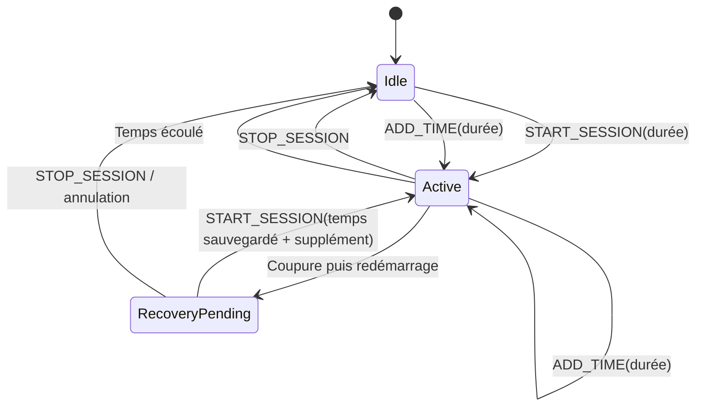

# Poste ESP32 - Monnayeur Game Room

Firmware d'un poste de jeu piloté par la centrale du système **Monnayeur Game
Room**. Chaque ESP32 de poste se connecte au réseau local, se fait découvrir par
la centrale, reçoit des commandes de session par HTTP et active un relais pendant
le temps de jeu attribué.

## Sommaire

- [Fonctions principales](#fonctions-principales)
- [Place du poste dans le système](#place-du-poste-dans-le-système)
- [Fonctionnement du firmware](#fonctionnement-du-firmware)
- [Configuration](#configuration)
- [Câblage du relais](#câblage-du-relais)
- [Installation et compilation](#installation-et-compilation)
- [Première mise en service](#première-mise-en-service)
- [API HTTP du poste](#api-http-du-poste)
- [Annonce envoyée à la centrale](#annonce-envoyée-à-la-centrale)
- [Persistance des données](#persistance-des-données)
- [Rôle de chaque fichier](#rôle-de-chaque-fichier)
- [Sécurité](#sécurité)
- [Dépannage](#dépannage)
- [Limites connues](#limites-connues)

## Fonctions principales

- connexion à un Wi-Fi enregistré ou défini dans le code ;
- portail captif de configuration si la connexion Wi-Fi échoue ;
- identité persistante composée d'un identifiant et d'un nom ;
- découverte automatique par annonce HTTP auprès de `gameroom.local` ;
- serveur HTTP local sur le port 80 ;
- démarrage, prolongation et arrêt d'une session ;
- activation d'un relais pendant toute la durée de la session ;
- arrêt automatique du relais lorsque le temps est écoulé ;
- remontée de l'état, de l'adresse IP et du temps restant à la centrale ;
- sauvegarde périodique du temps et reprise contrôlée après une coupure ;
- protection des commandes par un token Bearer partagé.

## Place du poste dans le système


La centrale décide du temps à attribuer. Le poste ne gère ni les pièces ni les
crédits : il exécute seulement la durée reçue, commande la sortie du relais et
publie son état.

Les deux ESP32 doivent :

1. être connectés au même réseau local ;
2. utiliser le même token de communication ;
3. pouvoir communiquer directement en HTTP ;
4. disposer de mDNS afin que le poste puisse résoudre `gameroom.local`.

## Fonctionnement du firmware

### Démarrage

La fonction `setup()` exécute les opérations suivantes :

1. ouvre le port série à 115200 bauds ;
2. construit l'identifiant matériel `chipId` depuis l'adresse eFuse de l'ESP32 ;
3. charge l'identifiant et le nom du poste depuis la NVS ;
4. configure la broche du relais et force le relais à l'arrêt ;
5. charge le dernier instantané de session et passe à `recovery_pending` s'il
   détecte une session interrompue, sinon à `idle` ;
6. enregistre les routes du serveur HTTP ;
7. charge les identifiants Wi-Fi et tente une connexion pendant 15 secondes ;
8. ouvre le portail de configuration si la connexion échoue ;
9. démarre le serveur HTTP sur le port 80.

### Boucle principale

La fonction `loop()` traite continuellement :

- les requêtes HTTP entrantes ;
- le DNS du portail captif et l'état de la connexion Wi-Fi ;
- l'expiration de la session en cours ;
- la sauvegarde périodique du temps restant ;
- l'annonce périodique du poste à la centrale.

Le code est non bloquant pendant une session : la date de fin est conservée dans
`endTimeMs` et comparée à `millis()`. Le relais est donc coupé automatiquement
sans attendre une nouvelle commande de la centrale.

### Cycle d'une session



- `START_SESSION` remplace la date de fin par `maintenant + durée` ;
- `ADD_TIME` ajoute la durée à la session active, ou démarre une session si le
  relais est arrêté ;
- `STOP_SESSION` annule le temps restant et désactive immédiatement le relais ;
- le temps restant exposé par l'API est arrondi à la seconde supérieure.

### Reprise après une coupure électrique

Le poste écrit le temps restant dans le namespace NVS `session` au démarrage
d'une session, après chaque `ADD_TIME`, puis toutes les 60 secondes. Si
l'alimentation est coupée alors que cette valeur est positive, le démarrage suivant :

1. maintient obligatoirement le relais à l'arrêt ;
2. place le poste dans l'état `recovery_pending` ;
3. expose `recoveryPending=true` et `recoveryRemaining` dans `/status` ;
4. envoie les mêmes données dans chaque annonce à la centrale ;
5. attend `START_SESSION` pour reprendre ou `STOP_SESSION` pour annuler.

La centrale additionne éventuellement les minutes saisies par l'opérateur au
temps sauvegardé avant d'envoyer `START_SESSION`. Chaque poste est autonome : une
coupure touchant plusieurs postes produit plusieurs reprises indépendantes.

Cette sauvegarde ne mesure pas la durée de la coupure. Sans horloge RTC secourue,
le temps hors tension n'est pas déduit. De plus, un instantané vieux de moins de
60 secondes peut rendre jusqu'à environ une minute de plus que le temps affiché
juste avant la coupure. L'intervalle constitue un compromis entre précision et
usure de la mémoire flash.

### Configuration Wi-Fi et portail captif

Au démarrage, le firmware utilise en priorité les identifiants enregistrés dans
le namespace NVS `wifi`. S'ils n'existent pas, il essaie les valeurs
`WIFI_SSID` et `WIFI_PASSWORD` de `PosteConfig.h`, à condition que le SSID ne soit
plus `YOUR_WIFI`.

Si la connexion échoue, l'ESP32 crée un point d'accès :

| Paramètre | Valeur par défaut |
|---|---|
| Préfixe du SSID | `GAMEROOM-POSTE` |
| SSID réel | `GAMEROOM-POSTE-<chipId>` |
| Mot de passe | aucun, réseau ouvert |
| Adresse habituelle | `http://192.168.4.1` |

Le portail scanne les réseaux disponibles et permet aussi de saisir un SSID
manuellement. L'adressage est **automatique (DHCP)** par défaut. Le mode
**manuel (IP fixe)** demande une adresse IPv4, une passerelle et un masque ; les
DNS principal et secondaire sont facultatifs. Les identifiants et les paramètres
réseau ne sont enregistrés qu'après une connexion réussie. Le poste affiche
uniquement sa nouvelle adresse IP, puis redémarre automatiquement après huit
secondes.

L'ESP32 ne fournit pas de proxy HTTP système. Les annonces mDNS et les échanges
avec la centrale utilisent donc toujours une connexion directe au réseau local.
Le `chipId` provient de l'eFuse et est disponible même sur un poste neuf : chaque
poste diffuse ainsi un nom de point d'accès distinct avant son identification.

Quand le portail est actif, `/` et les URL usuelles de détection de portail
captif ouvrent la même page de configuration Wi-Fi que la centrale.

### Identité et découverte

L'identité du poste contient :

- `chipId` : identifiant matériel calculé automatiquement et non modifiable ;
- `id` : identifiant technique unique, dérivé automatiquement du `chipId` par la
  centrale et jamais demandé dans l'interface ;
- `name` : nom lisible, par exemple `Poste 1` ;
- `configured` : vrai uniquement si `id` et `name` ne sont pas vides.

Une fois connecté au Wi-Fi et hors du portail captif, le poste :

1. démarre mDNS sous le nom `poste-<chipId>` en minuscules ;
2. résout le nom `gameroom.local` ;
3. envoie son annonce à `POST /poste/announce` toutes les cinq secondes.

Un poste sans identité apparaît dans les postes découverts de la centrale. La
centrale lui attribue ensuite automatiquement son `id` et transmet le `name`
saisi avec `POST /configure`.

## Configuration

Les constantes se trouvent dans `PosteConfig.h` :

| Constante | Valeur par défaut | Rôle |
|---|---|---|
| `WIFI_SSID` | `YOUR_WIFI` | SSID de secours compilé dans le firmware. |
| `WIFI_PASSWORD` | `YOUR_PASSWORD` | Mot de passe du SSID de secours. |
| `WIFI_CONNECT_TIMEOUT_MS` | `15000` | Délai maximal de connexion Wi-Fi. |
| `WIFI_SETUP_AP_SSID_PREFIX` | `GAMEROOM-POSTE` | Préfixe suivi automatiquement du `chipId` matériel. |
| `WIFI_SETUP_AP_PASSWORD` | chaîne vide | Mot de passe du point d'accès ; huit caractères minimum pour le protéger. |
| `CENTRAL_MDNS_HOSTNAME` | `gameroom` | Nom mDNS de la centrale, sans `.local`. |
| `ANNOUNCE_INTERVAL_MS` | `5000` | Période d'annonce à la centrale. |
| `SESSION_CHECKPOINT_INTERVAL_MS` | `60000` | Période de sauvegarde du temps restant pendant une session. |
| `DEFAULT_POST_ID` | chaîne vide | Identifiant initial si la NVS est vide. |
| `DEFAULT_POST_NAME` | chaîne vide | Nom initial si la NVS est vide. |
| `COMMAND_TOKEN` | valeur de développement | Secret partagé avec la centrale. |
| `RELAY_PIN` | GPIO 27 | GPIO commandant le relais. |
| `RELAY_ACTIVE_HIGH` | `true` | Niveau logique qui active le relais. |
| `HTTP_PORT` | `80` | Port du serveur HTTP local. |

Avant le déploiement, modifier au minimum `COMMAND_TOKEN`, `RELAY_PIN` et, si
nécessaire, `RELAY_ACTIVE_HIGH`. Le token doit être strictement identique à
`AppConfig::POSTE_COMMAND_TOKEN` dans le firmware de la centrale.

## Câblage du relais

Par défaut, le relais est piloté par le GPIO 27. Pour utiliser une autre broche,
remplacer cette valeur par le GPIO relié à l'entrée du module relais :

```cpp
static const int RELAY_PIN = 27;
static const bool RELAY_ACTIVE_HIGH = true;
```

Câblage logique typique :

| ESP32 | Module relais |
|---|---|
| GPIO défini par `RELAY_PIN` | `IN` |
| `GND` | `GND` |
| alimentation adaptée au module | `VCC` |

> Ne jamais alimenter directement une charge secteur ou une charge importante
> depuis un GPIO. Utiliser un module relais compatible 3,3 V, une alimentation
> appropriée et une isolation adaptée. Le câblage de la partie puissance doit
> être réalisé selon les règles de sécurité applicables.

Certains modules sont actifs à l'état bas. Dans ce cas, utiliser
`RELAY_ACTIVE_HIGH = false`. Au démarrage et à l'arrêt d'une session, le firmware
écrit toujours le niveau correspondant à l'état désactivé.

## Installation et compilation

### Prérequis

- une carte ESP32 compatible avec le framework Arduino ;
- un câble USB de données ;
- Arduino IDE ou `arduino-cli` ;
- le package de cartes **esp32 by Espressif Systems** ;
- la bibliothèque **ArduinoJson**.

`WiFi`, `WebServer`, `DNSServer`, `Preferences`, `ESPmDNS` et `HTTPClient` sont
fournis par le package Arduino pour ESP32.

### Avec Arduino IDE

1. Ouvrir `poste-esp32.ino`.
2. Installer **ArduinoJson** depuis le gestionnaire de bibliothèques.
3. Sélectionner une carte compatible, par exemple **ESP32 Dev Module**.
4. Adapter les constantes de `PosteConfig.h`.
5. Sélectionner le port série de la carte.
6. Cliquer sur **Vérifier**, puis **Téléverser**.
7. Ouvrir le moniteur série à 115200 bauds.

### Avec arduino-cli

```bash
arduino-cli core install esp32:esp32
arduino-cli lib install ArduinoJson
arduino-cli compile --fqbn esp32:esp32:esp32 .
arduino-cli upload --fqbn esp32:esp32:esp32 --port PORT_SERIE .
```

Adapter `PORT_SERIE`, par exemple `/dev/cu.usbserial-0001` sous macOS ou `COM3`
sous Windows.

## Première mise en service

1. Vérifier que la centrale fonctionne et publie `gameroom.local`.
2. Téléverser le firmware du poste après avoir configuré le token et le relais.
3. Ouvrir le moniteur série à 115200 bauds.
4. Si aucun Wi-Fi valide n'est connu, se connecter au point d'accès
   `GAMEROOM-POSTE-<chipId>` affiché dans le moniteur série.
5. Ouvrir `http://192.168.4.1` si le portail ne s'affiche pas automatiquement.
6. Choisir le même réseau local que celui de la centrale et saisir son mot de
   passe.
7. Attendre le message de connexion et noter l'adresse IP affichée.
8. Dans l'interface de la centrale, ouvrir **Gestion des postes**.
9. Attendre l'apparition du nouveau `chipId` dans les postes découverts.
10. Attribuer un identifiant et un nom au poste.
11. Affecter du temps et vérifier le passage à `active`, l'activation du relais
    et le décompte du temps restant.

## API HTTP du poste

Le serveur écoute en HTTP sur le port 80. Les routes de commande attendent cet
en-tête :

```http
Authorization: Bearer VOTRE_TOKEN_PARTAGE
```

Le firmware refuse toutes les routes protégées si `COMMAND_TOKEN` contient moins
de 16 caractères.

### Routes

| Méthode | Route | Authentification | Description |
|---|---|---|---|
| GET | `/` | Non | Retourne `Poste OK`, ou redirige vers le portail Wi-Fi. |
| GET | `/status` | Non | Retourne l'identité, l'état du relais et le temps restant. |
| POST | `/configure` | Bearer | Enregistre un `id` et un `name` non vides. |
| POST | `/identity/clear` | Bearer | Arrête la session et efface l'identité du poste. |
| POST | `/command` | Bearer | Exécute une commande de session ou un ping. |
| GET | `/wifi` | Non, portail uniquement | Affiche le formulaire de configuration Wi-Fi. |
| POST | `/wifi/save` | Non, portail uniquement | Teste et sauvegarde le Wi-Fi soumis par le formulaire. |

Une route protégée réussie renvoie :

```json
{"ok": true}
```

Une erreur renvoie un statut HTTP `400` ou `401` et un objet de la forme :

```json
{"error": "message"}
```

### Lire l'état

```bash
curl http://ADRESSE_IP_DU_POSTE/status
```

Exemple de réponse :

```json
{
  "chipId": "1234ABCDEF12",
  "configured": true,
  "id": "post1",
  "name": "Poste 1",
  "ip": "192.168.1.42",
  "status": "active",
  "relay": true,
  "remaining": 1784,
  "recoveryPending": false,
  "recoveryRemaining": 0
}
```

Après une coupure, `status` vaut `recovery_pending`, `relay` et `remaining`
valent respectivement `false` et `0`, tandis que `recoveryRemaining` contient le
dernier temps sauvegardé.

### Configurer l'identité

```bash
curl -X POST http://ADRESSE_IP_DU_POSTE/configure \
  -H 'Authorization: Bearer VOTRE_TOKEN_PARTAGE' \
  -H 'Content-Type: application/json' \
  -d '{"id":"post1","name":"Poste 1"}'
```

### Démarrer une session

La durée est exprimée en secondes :

```bash
curl -X POST http://ADRESSE_IP_DU_POSTE/command \
  -H 'Authorization: Bearer VOTRE_TOKEN_PARTAGE' \
  -H 'Content-Type: application/json' \
  -d '{"action":"START_SESSION","duration":1800}'
```

### Ajouter du temps

```bash
curl -X POST http://ADRESSE_IP_DU_POSTE/command \
  -H 'Authorization: Bearer VOTRE_TOKEN_PARTAGE' \
  -H 'Content-Type: application/json' \
  -d '{"action":"ADD_TIME","duration":900}'
```

### Arrêter une session

```bash
curl -X POST http://ADRESSE_IP_DU_POSTE/command \
  -H 'Authorization: Bearer VOTRE_TOKEN_PARTAGE' \
  -H 'Content-Type: application/json' \
  -d '{"action":"STOP_SESSION"}'
```

### Tester la communication

La commande `PING` ne modifie pas l'état ; une réponse `200` confirme seulement
que le poste accepte le token et traite les commandes.

```bash
curl -X POST http://ADRESSE_IP_DU_POSTE/command \
  -H 'Authorization: Bearer VOTRE_TOKEN_PARTAGE' \
  -H 'Content-Type: application/json' \
  -d '{"action":"PING"}'
```

## Annonce envoyée à la centrale

Toutes les cinq secondes, le poste envoie une requête à :

```text
POST http://gameroom.local/poste/announce
```

L'en-tête Bearer et `Content-Type: application/json` sont ajoutés. Le contenu est
équivalent à :

```json
{
  "chipId": "1234ABCDEF12",
  "configured": true,
  "id": "post1",
  "name": "Poste 1",
  "status": "active",
  "relay": true,
  "remaining": 1784,
  "recoveryPending": false,
  "recoveryRemaining": 0,
  "ip": "192.168.1.42"
}
```

L'annonce n'est pas envoyée tant que le Wi-Fi est déconnecté ou que le portail
captif est actif. L'échec d'une annonce n'arrête pas le poste ni une session en
cours ; une nouvelle tentative a lieu au prochain intervalle.

## Persistance des données

Le firmware utilise `Preferences`, donc la mémoire NVS de l'ESP32 :

| Namespace | Clés | Données |
|---|---|---|
| `wifi` | `ssid`, `password` | Réseau Wi-Fi validé par le portail. |
| `identity` | `id`, `name` | Identité logique attribuée par la centrale. |
| `session` | `remaining` | Dernier temps restant sauvegardé ; une valeur positive indique une session interrompue. |

Le `chipId` est recalculé depuis l'eFuse à chaque démarrage.

La date de fin basée sur `millis()` et l'état instantané du relais restent en RAM.
Un redémarrage coupe donc toujours le relais. Si une session active avait été
sauvegardée, le poste conserve toutefois son temps récupérable et attend la
décision de reprise de la centrale au lieu de revenir directement à `idle`.

## Rôle de chaque fichier

| Fichier | Rôle |
|---|---|
| `poste-esp32.ino` | Point d'entrée Arduino. Crée l'état partagé et le serveur, initialise tous les services dans `setup()` et les exécute dans `loop()`. |
| `PosteConfig.h` | Centralise les constantes : Wi-Fi, portail captif, mDNS, token, délais, intervalle de sauvegarde, GPIO et port HTTP. |
| `PosteState.h` | Définit `PosteState`, la structure en RAM partagée : identité, session, reprise, relais et réseau. |
| `RelayService.h` | Déclare l'interface de gestion du relais et des sessions. |
| `RelayService.cpp` | Pilote le GPIO, gère le temps, sauvegarde la session en NVS et restaure une reprise en attente après coupure. |
| `PosteIdentityService.h` | Déclare le chargement, l'enregistrement et l'effacement de l'identité du poste. |
| `PosteIdentityService.cpp` | Construit le `chipId` depuis l'eFuse et conserve `id`/`name` dans le namespace NVS `identity`. |
| `PosteAnnounceService.h` | Déclare la mise à jour périodique de l'annonce. |
| `PosteAnnounceService.cpp` | Démarre mDNS pour le poste, résout la centrale et lui envoie l'état en JSON toutes les cinq secondes. |
| `PosteWebServer.h` | Déclare l'enregistrement des routes HTTP du poste. |
| `PosteWebServer.cpp` | Implémente `/status`, `/configure`, `/identity/clear`, `/command`, les réponses JSON et la validation du token Bearer. |
| `WiFiConfigService.h` | Déclare l'initialisation et le suivi de la connexion Wi-Fi. |
| `WiFiConfigService.cpp` | Charge et sauvegarde les identifiants Wi-Fi, tente la connexion, crée le point d'accès, sert le portail captif et traite son DNS. |
| `.DS_Store` | Métadonnées créées par macOS ; aucun rôle dans le firmware et peut être ignoré par Git. |

Les fichiers `.h` exposent les interfaces et structures ; les fichiers `.cpp`
contiennent leur implémentation. Cette séparation permet au fichier `.ino` de
rester limité à l'orchestration générale.

## Sécurité

Avant une utilisation réelle :

1. remplacer `COMMAND_TOKEN` par un secret long et différent de la valeur du
   dépôt ;
2. reporter exactement le même secret dans `POSTE_COMMAND_TOKEN` sur la
   centrale ;
3. protéger le point d'accès de configuration avec un mot de passe d'au moins
   huit caractères ;
4. utiliser un réseau local privé et isolé ;
5. ne pas rediriger le port 80 du poste vers Internet ;
6. protéger l'accès physique à l'ESP32 et à son câblage.

Les communications utilisent HTTP sans TLS. Le statut est public sur le réseau
local. Le token et les éventuels identifiants Wi-Fi compilés sont présents dans
le firmware, tandis que les identifiants configurés par le portail sont stockés
dans la NVS sans chiffrement applicatif.

## Dépannage

### Le portail Wi-Fi ne s'ouvre pas

- vérifier la connexion au SSID `GAMEROOM-POSTE-<chipId>` ;
- ouvrir manuellement `http://192.168.4.1` ;
- désactiver temporairement les données mobiles ou le VPN ;
- consulter le moniteur série à 115200 bauds ;
- redémarrer le poste pour relancer la tentative de connexion et le portail.

### Le poste n'apparaît pas dans la centrale

- vérifier que les deux ESP32 sont sur le même réseau ;
- ouvrir `http://ADRESSE_IP_DU_POSTE/status` ;
- vérifier que `gameroom.local` résout vers la centrale ;
- comparer `COMMAND_TOKEN` du poste et `POSTE_COMMAND_TOKEN` de la centrale ;
- vérifier que le réseau n'isole pas ses clients Wi-Fi ;
- attendre au moins cinq secondes après la connexion.

### Les commandes renvoient `401 unauthorized`

- envoyer l'en-tête `Authorization: Bearer ...` ;
- utiliser exactement le token de `PosteConfig.h` ;
- vérifier que le token contient au moins 16 caractères ;
- recompiler et téléverser le poste après toute modification du token.

### Le relais fonctionne à l'envers

Inverser `RELAY_ACTIVE_HIGH`. Utiliser `true` si l'entrée du relais s'active au
niveau haut et `false` si elle s'active au niveau bas.

### Le relais ne commute pas

- vérifier que `RELAY_PIN` correspond au GPIO réellement câblé ;
- vérifier la masse commune et l'alimentation du module ;
- confirmer que le module accepte un signal logique de 3,3 V ;
- envoyer manuellement `START_SESSION`, puis consulter `/status` ;
- observer les messages `START_SESSION` et `STOP_SESSION` sur le port série.

## Limites connues

- le relais repart toujours désactivé et une session interrompue exige une
  relance ou une annulation manuelle depuis la centrale ;
- le dernier instantané peut restituer environ 60 secondes de plus que le temps
  réel et ne déduit pas le temps passé hors tension ;
- diminuer fortement `SESSION_CHECKPOINT_INTERVAL_MS` augmente les écritures et
  donc l'usure de la mémoire flash ;
- les communications et le portail utilisent HTTP sans chiffrement ;
- le portail Wi-Fi est ouvert avec la configuration par défaut ;
- il n'existe pas de route HTTP dédiée à l'effacement des identifiants Wi-Fi ;
- le firmware n'impose pas de durée maximale de session ;
- la résolution de `gameroom.local` dépend du support mDNS du réseau ;
- le serveur HTTP Arduino traite un nombre limité de requêtes et convient à un
  réseau local, pas à une exposition publique ;
- le changement de `COMMAND_TOKEN` nécessite de recompiler chaque poste et de
  garder la même valeur sur la centrale.
